# T3A2 Full Stack App - Part A
---
## R1 - Description
### Purpose:
Our key focus with building this application, is to provide a single location for a media driven community, to find current and upcoming blogs and reviews about games, music and films. Users will be able to connect with other users, through post engagements such as comments, likes and dislikes, as well as, rating reviews that have been made, providing a sense of community. 

### Functionality / Features:

#### Blog & Review Posts
- Display blogs for various media categories
- Display Reviews for various media categories

#### Signed Up Users
- Create account
- Enabled post engagements
  - Comments
  - Like
  - Dislike
  - Rate reviews

#### Non-Signed Up Users
- Limited access to application
- No post engagements

#### Blog and Review Filters
- Spoiler filters - Review or Blog containing a spoiler
- Category filter - Music, Movie or Game
- Blog or Review filter

### Target Audience:
The target audience for this application is media enthusiasts looking for relevant and upcoming information, specifically for games, music and films. 

### Tech Stack: 

- MongoDB (Database)
    - Atlas
    - AWS
    - Mongoose  
- Node.js (Web Server) 
- Express.js (Back-end)
- React.js (Front-end)
- Heroku (Back-end Deployment)
- Netlify (Front-end Deployment)
- Cloudinary (Third-Part API)
- Github (Source Control)
- Trello (Task/Project Management)

---
## R2 - Dataflow Diagram:
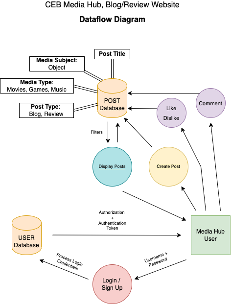

---
## R3 - Architecture Diagram:

---
## R4 - User Stories:
| Role          | Description                                                                                                                                                                |
| ------------- | -------------------------------------------------------------------------------------------------------------------------------------------------------------------------- |
| Administrator | As an administrator, I want to have overall control in the application, so I can properly manage and update the content and it's users on the website.                     |
| App Manager   | As an app manager, I want a structured heirarchy of authenticated roles, so that my team can properly manage my application and be delegated to those roles of management. |
| Creator       | As a journalist, I want to easily create content and catagorise it, so that my readers can find what they're seeking and it's easy for me to get it out there.             |
| Creator       | As a creator, I want comments and likes/dislikes on my content, so I can see what my users are thinking and feeling about that content.                                    |
| User          | As a media enthusiast, I want categories for content, so I can find content that i'm interested in.                                                                        |
| User          | As a commenter, I want to be able to comment on the blog posts, in an attempt to add more to the conversation.                                                             |
| User          | As a user, I want to be able to like/dislike blog post, to contribute to the overall feedback on the creators post.                                                        |
| User          | As an opinionated person, I'd like to give ratings to a review, so others can see whether or not It's a good, or fair review.                                              |
| User          | As an unspoilt human, I want to know if an article contains spoilers, so I can remain spoiler free in my life.                                                             |
| User          | As a User, i want to be able to login/logout, so my username can be displayed to others when interacting.                                                                  |

---
## R5 - Wireframes:
#### Login/Sign Up:

#### Home Page:

#### Create Post:

#### Created Post:

#### Comments:

---
## R6 - Trello Screenshots:
Each job was assigned using coloured labels with each name attached.
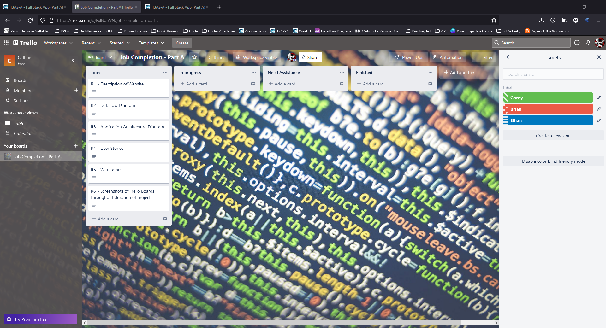
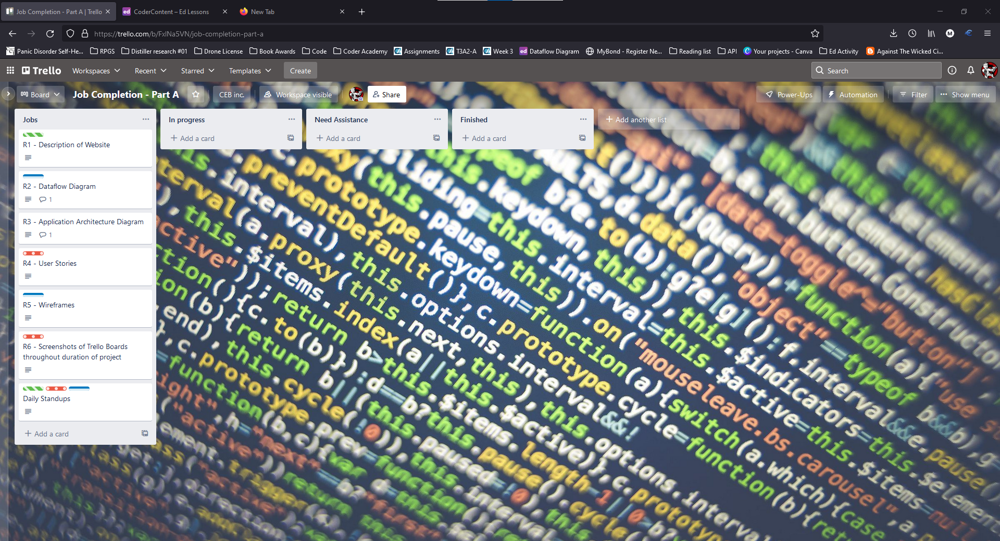
Once jobs were assigned, they were moved into the appropriate column depending on the progress of that job. 
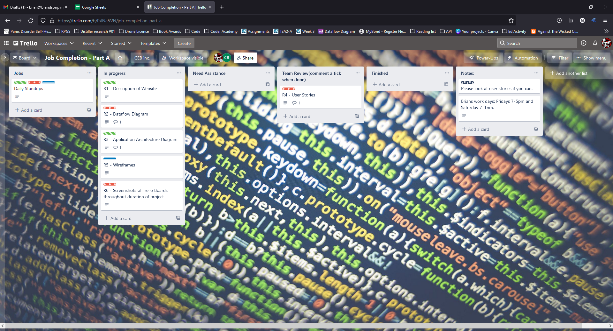
Jobs were moved into the Review column to be checked by the team to assure everyone approved, before moving it into the finished column. Notes were added with each job being moved to the review column, inside the notes column to provide context of what needed to be reviewed.
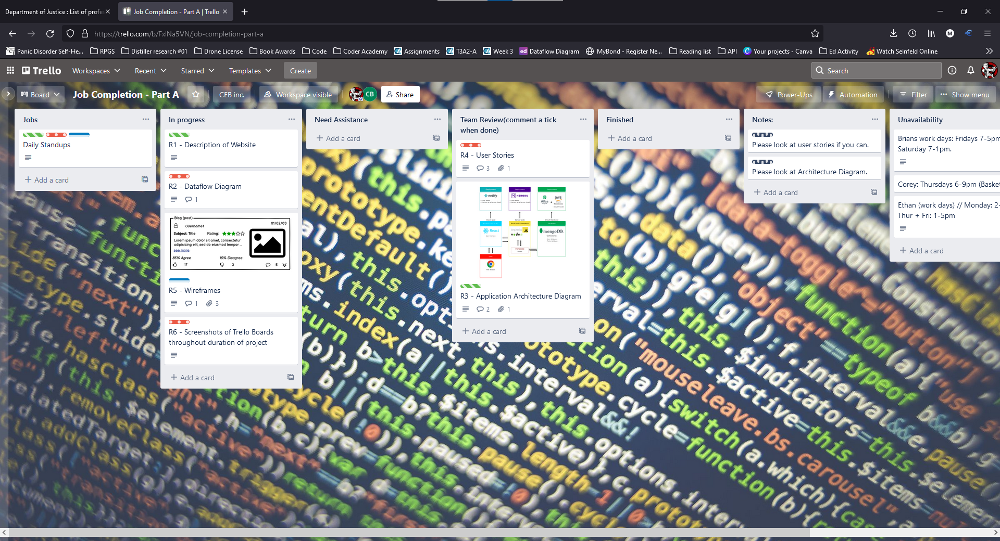
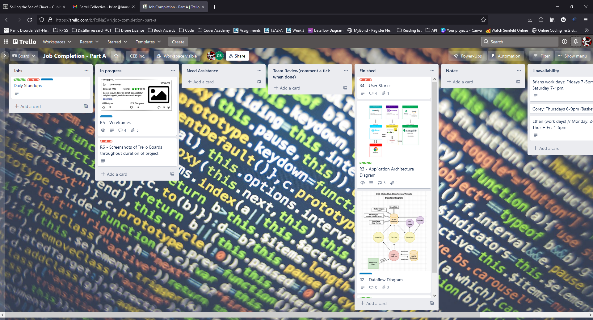
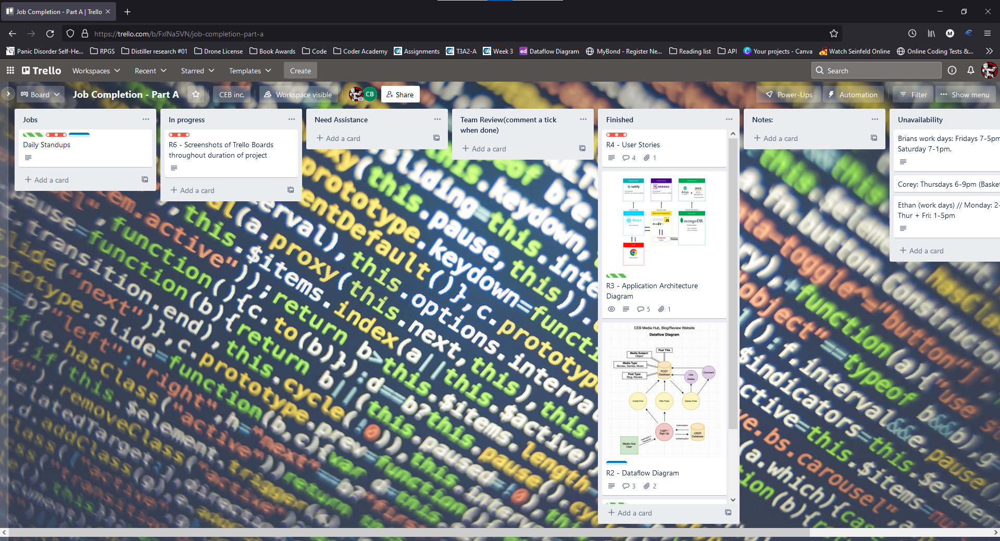
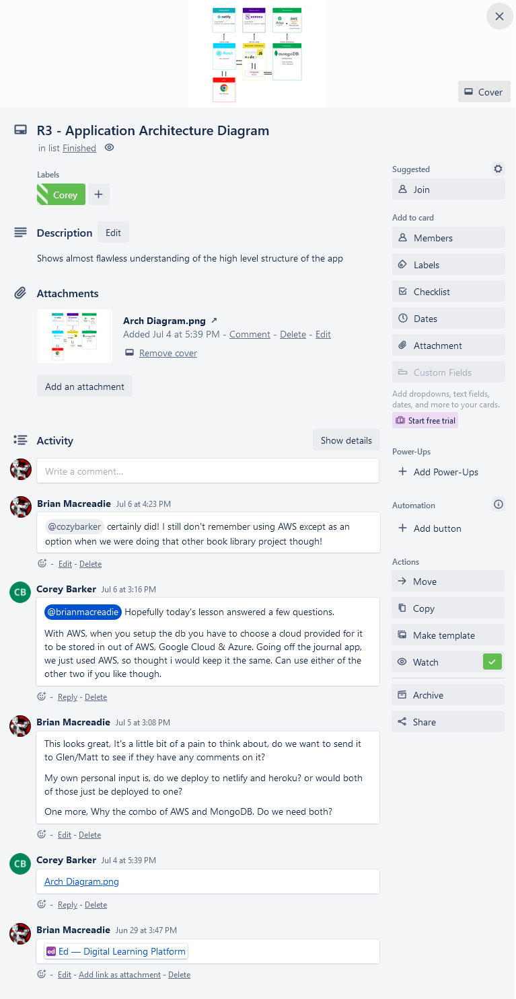
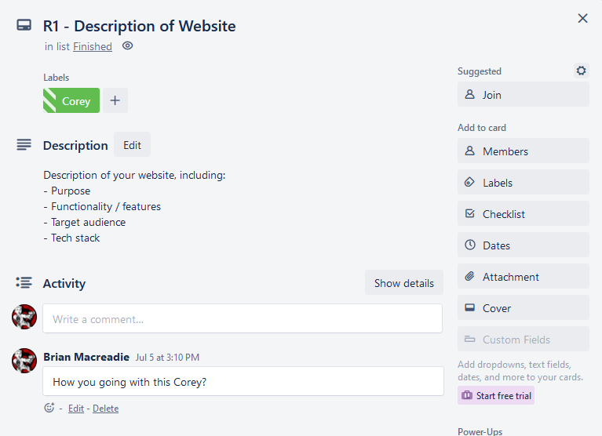
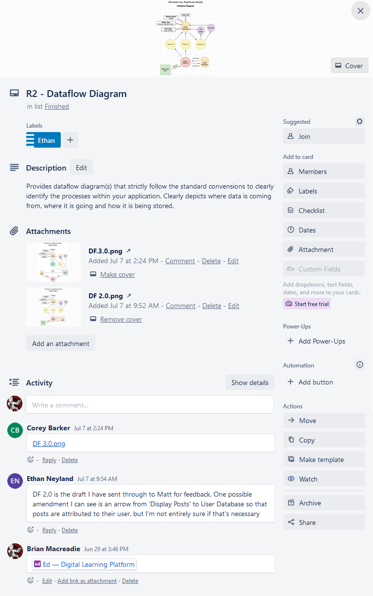
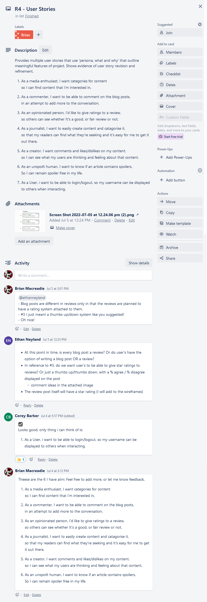
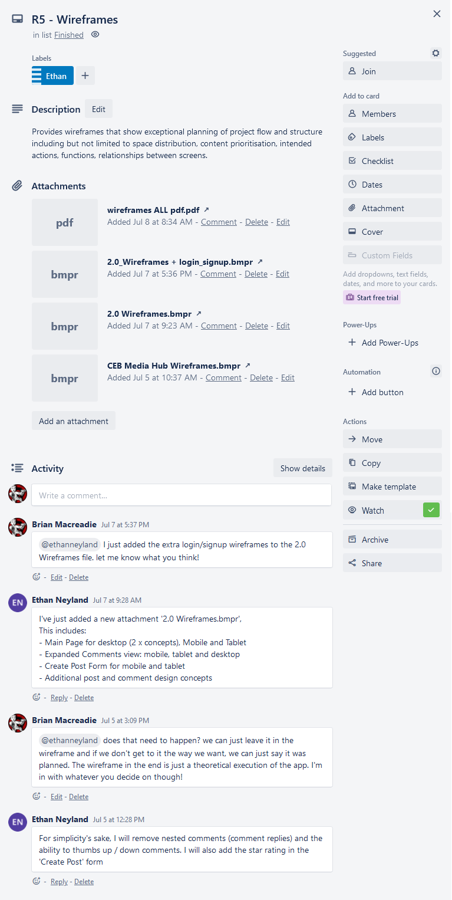
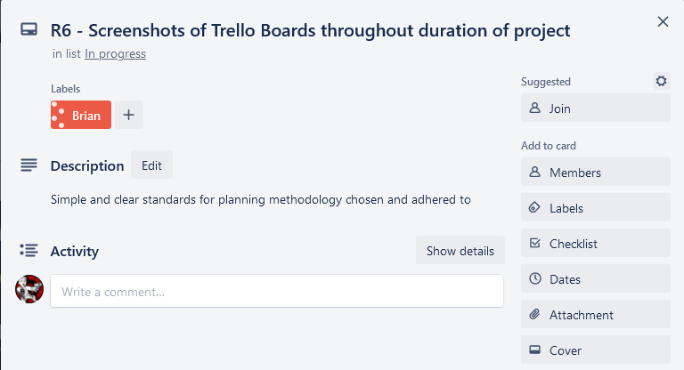
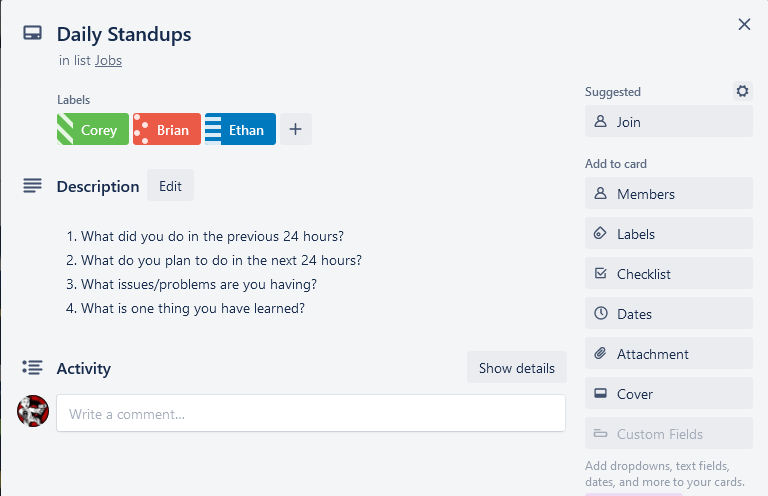

